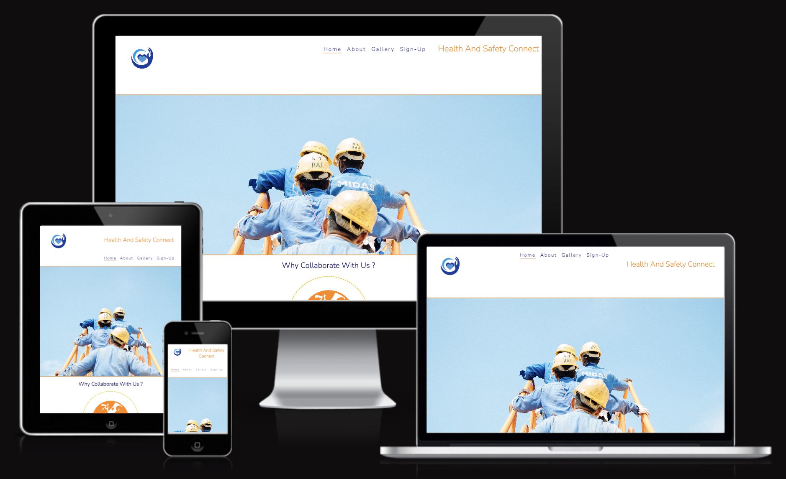
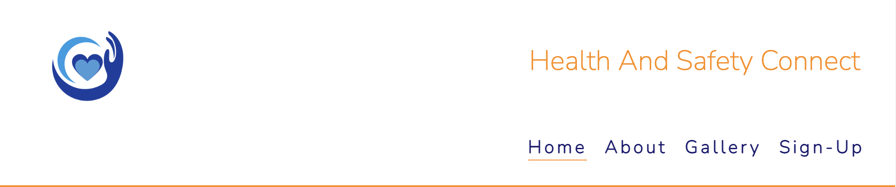
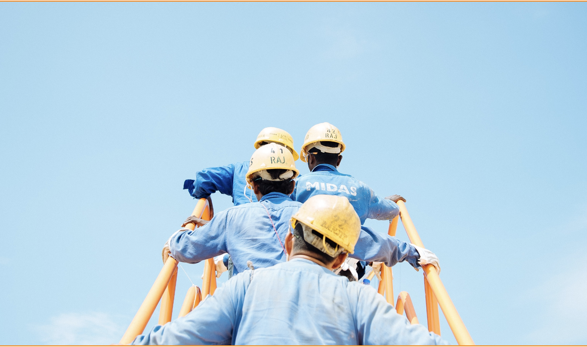
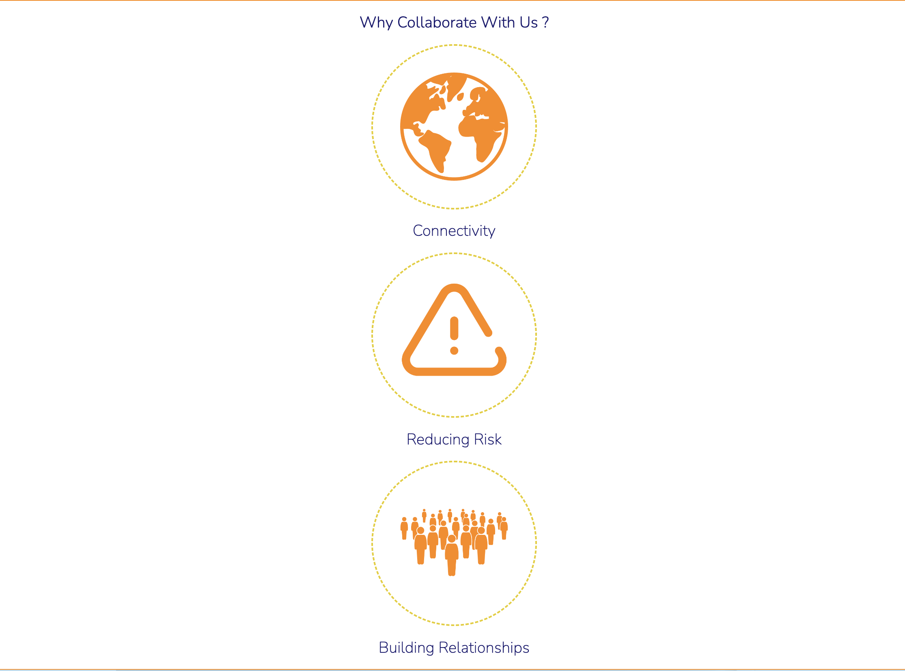
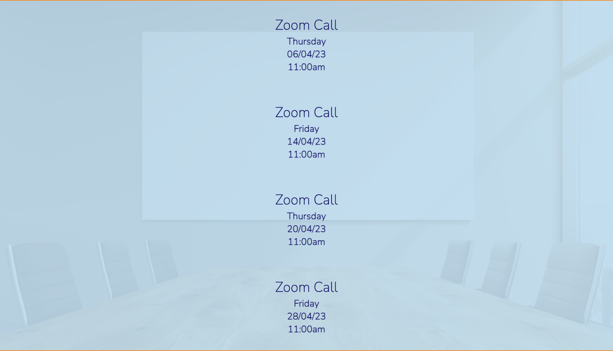
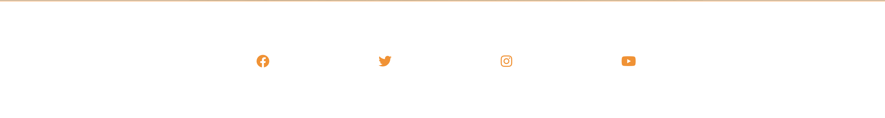
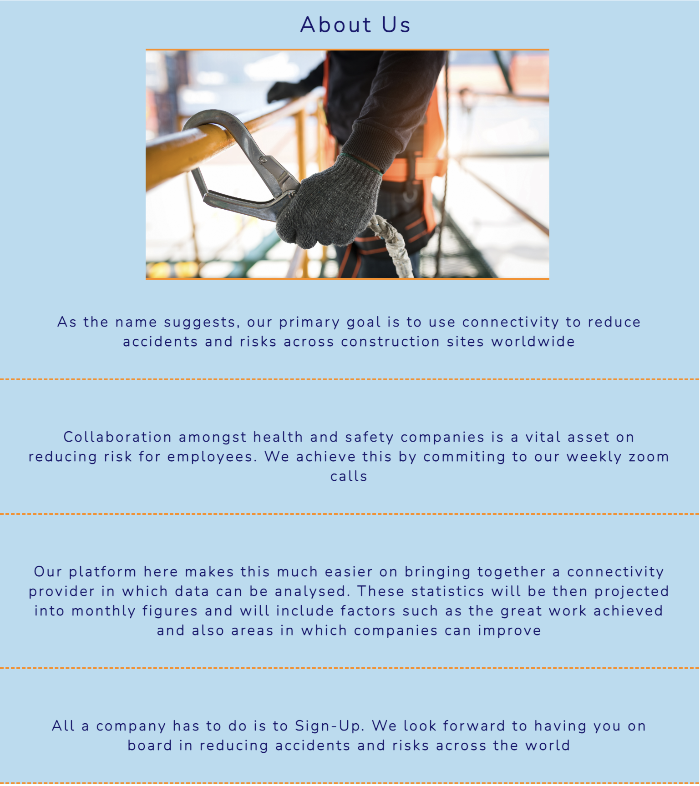
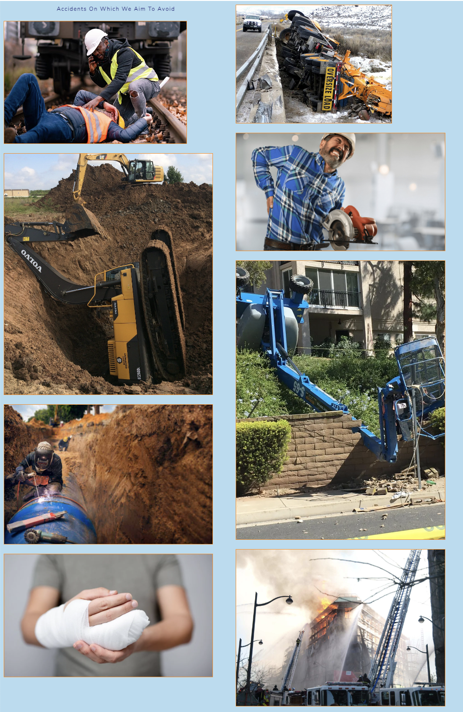
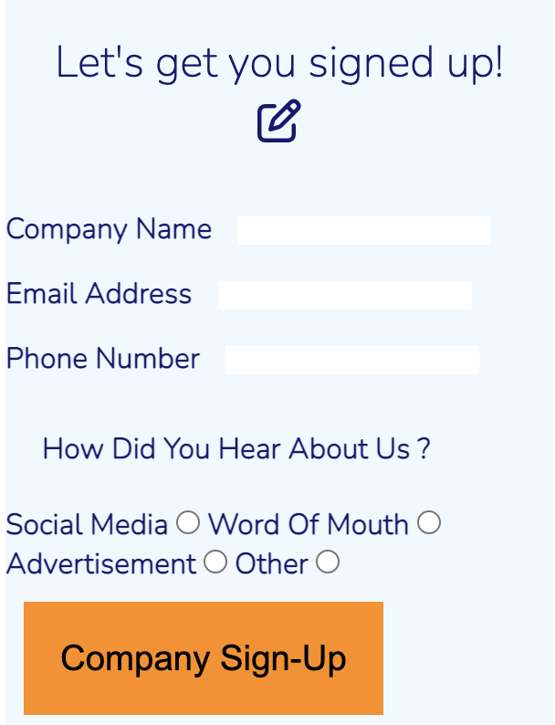

# Health And Safety Connect

- Health And Safety Connect is a site connecting health and safety companies internationally in order to reduce accidents and risks on construction sites.
- This site will be therefore targeted toward companies who look to engage together in reducing hazards in the workplace. 

## Features 

### Existing Features

- __Navigation Bar__

  - A responsive navigation bar at the top which allows the user to navigate through the site.
  - It includes links to the Logo, Home page, About, Gallery and Sign Up page and is identical in each page to allow for easy navigation.

- __The landing page image__
 
  - This section introduces the user to Health And Safety Connect with an eye catching animation to grab their attention

- __Club Ethos Section__

  - The callaboration section will allow the user to see the benefits of joining the Health And Safety Connect platform. 
  - This should encourage the user to consider signing up thier company in ordeer to reduce risk. 

- __Meetup Times section__

  - This section will allow the user to see exactly when the zoom calls will happen, the date and time of the calls will be issued here. 
  - This section will be updated as these times change to keep the user up to date. 

- __The Footer__ 

  - The footer section includes links to the relevant social media sites for Health And Safety Connect. The links will open to a new tab to allow easy navigation for the user. 
  - The footer is valuable to the user as it encourages them to keep connected via social media

- __About Us__

 - The about us page will go further into detail about Health And Safety Connect goals.

 

- __Gallery__

  - The gallery will provide the user with supporting images to see the work accidents on which Health And Safety Connect aims to avoid. 
  

- __The Sign Up Page__

  - This page will allow the user to get their company signed up to Health And Safety Connect to start their collaboration journey with the community. The user will input information on how they heard about us as this will accelerate our growth when it comes to the marketing aspect of this platform. The user will be asked to submit their full name and email address and phone number. 

## Testing 

I tested the site personally on my Iphone device, going through the entire process, checking buttons, functions, checking out, etc. I was personally unable to test on android.
The site was sent to friends and relatives for them to follow the same process. They have tested on their devices, including android.
Chrome was utilised to inspect the site in mobile format, going through the pages and functions.

### Validator Testing 

HTML has been validated with W3C HTML5 Validator.
https://validator.w3.org/nu/?doc=https%3A%2F%2F8000-phillywhitt-healthandsa-o15wng1v955.ws-eu89.gitpod.io%2F

CSS has been validated with W3C CSS Validator 
https://jigsaw.w3.org/css-validator/validator?uri=https%3A%2F%2F8000-phillywhitt-healthandsa-o15wng1v955.ws-eu89.gitpod.io%2F&profile=css3svg&usermedium=all&warning=1&vextwarning=&lang=en

## Deployment

- The site was deployed to GitHub pages. The steps to deploy are as follows: 
  - In the GitHub repository, navigate to the Settings tab 
  - From the source section drop-down menu, select the Master Branch
  - Once the master branch has been selected, the page will be automatically refreshed with a detailed ribbon display to indicate the successful deployment. 

The live link can be found here - https://code-institute-org.github.io/love-running-2.0/index.html 

## Credits 

My mentor has been a huge addition in developing my first website. The Love Running project was also great help.

### Content 

- Content for the website was written by the owner of Health And Safety Connect Philip Whitty.
- The icons in the footer were taken from [Font Awesome](https://fontawesome.com/)

### Media

- The photos used on the home and sign up page are from Canva
- The images used for the gallery page were also taken from Canva
- The link for canva is here https://www.canva.com/

